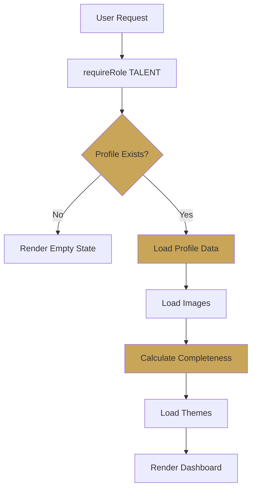
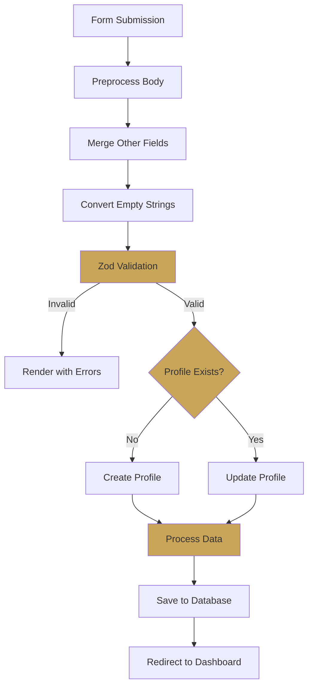
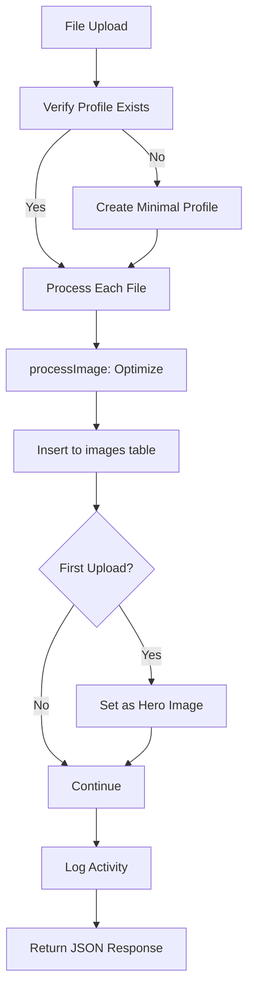
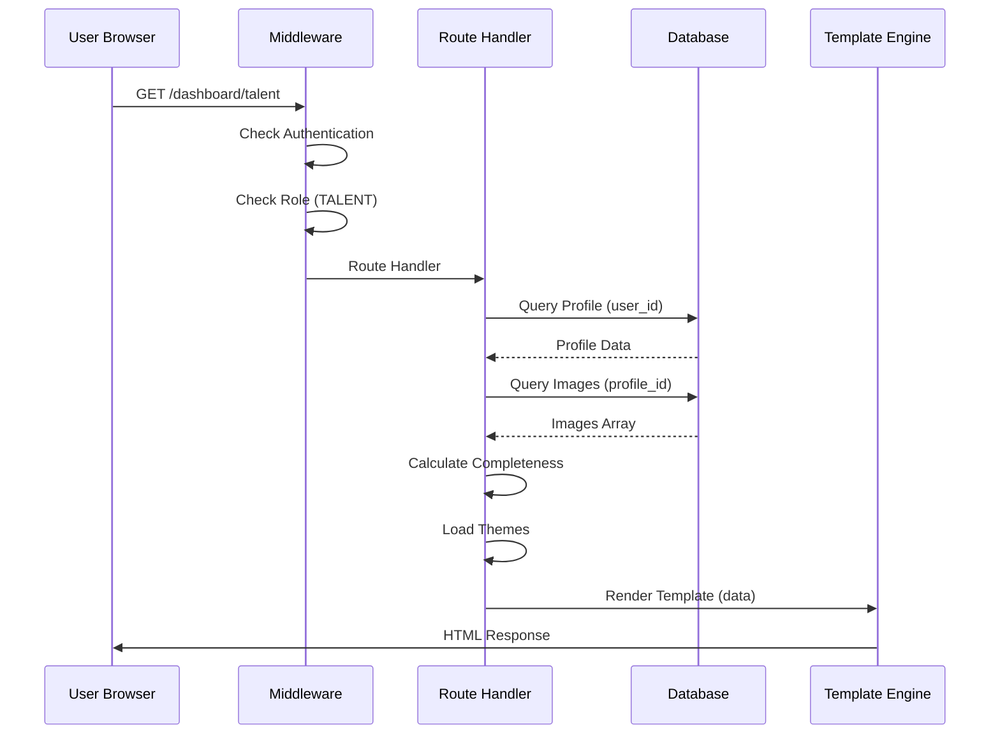
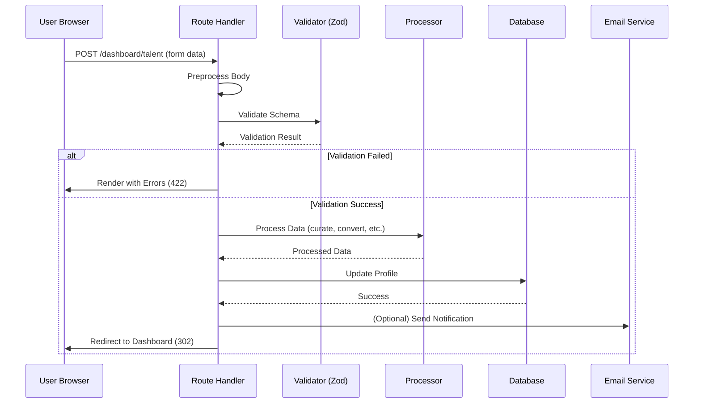

# Dashboard Comprehensive Analysis Report

**Generated:** 2025-01-XX  
**Scope:** Complete dashboard architecture, data flow, and system connections  
**Files Analyzed:** `src/routes/dashboard.js`, `views/dashboard/talent.ejs`, `views/layouts/dashboard.ejs`

---

## Executive Summary

The Pholio Dashboard is a role-based management interface that serves two distinct user types:
- **Talent Dashboard** (`/dashboard/talent`): For talent users to manage their profiles, upload images, track applications, and customize portfolios
- **Agency Dashboard** (`/dashboard/agency`): For agency users to manage applications, scout talent, and track performance

This report provides a comprehensive analysis of the dashboard architecture, data flow, connections, and functionality.

---

## 1. Architecture Overview

### 1.1 Entry Point & Routing

```
User Request → Authentication Middleware → Role-Based Redirect → Dashboard Route
```

**Entry Flow:**
1. User visits `/dashboard`
2. `GET /dashboard` route checks authentication
3. Queries user role from database
4. Redirects to role-specific dashboard:
   - `TALENT` → `/dashboard/talent`
   - `AGENCY` → `/dashboard/agency`

**Key Files:**
- `src/routes/dashboard.js` (lines 28-52): Main redirect logic
- `src/middleware/auth.js`: `requireRole()` middleware ensures proper authentication

### 1.2 Role-Based Architecture

The dashboard uses a **strict role-based access control (RBAC)** system:

```javascript
// Talent Dashboard Routes
router.get('/dashboard/talent', requireRole('TALENT'), ...)
router.post('/dashboard/talent', requireRole('TALENT'), ...)

// Agency Dashboard Routes  
router.get('/dashboard/agency', requireRole('AGENCY'), ...)
router.post('/dashboard/agency/...', requireRole('AGENCY'), ...)
```

**Security:**
- All routes use `requireRole()` middleware
- Session-based authentication (`req.session.userId`)
- Database-level ownership verification for all operations

---

## 2. Talent Dashboard Deep Dive

### 2.1 Data Loading Flow (GET /dashboard/talent)



**Data Queries:**
1. **Profile Lookup:**
   ```javascript
   const profile = await knex('profiles')
     .where({ user_id: req.session.userId })
     .first();
   ```

2. **Images Loading:**
   ```javascript
   const images = await knex('images')
     .where({ profile_id: profile.id })
     .orderBy('sort', 'asc');
   ```

3. **Completeness Calculation:**
   ```javascript
   const completeness = {
     basics: Boolean(profile.first_name && profile.last_name && 
                     profile.city && profile.bio_curated),
     imagery: images.length >= 2,
     hero: Boolean(profile.hero_image_path || images.length > 0)
   };
   ```

4. **Theme Loading:**
   ```javascript
   const allThemes = getAllThemes();
   const freeThemes = getFreeThemes();
   const proThemes = getProThemes();
   const currentTheme = profile.pdf_theme || getDefaultTheme();
   ```

**Template Data Structure:**
```javascript
{
  title: 'Talent Dashboard',
  profile: { /* Full profile object */ },
  images: [ /* Array of image objects */ ],
  completeness: { basics, imagery, hero },
  stats: { heightFeet: '5\'10"' },
  shareUrl: 'https://pholio.me/username',
  user: { /* User object */ },
  currentUser: { /* User object */ },
  isDashboard: true,
  layout: 'layouts/dashboard',
  allThemes: [ /* Theme objects */ ],
  freeThemes: [ /* Theme objects */ ],
  proThemes: [ /* Theme objects */ ],
  currentTheme: 'classic-serif',
  baseUrl: 'https://pholio.me'
}
```

### 2.2 Profile Update Flow (POST /dashboard/talent)



**Key Processing Steps:**

1. **Preprocessing (lines 213-275):**
   - Merges `_other` fields (e.g., `shoe_size_other` → `shoe_size`)
   - Converts empty strings to `undefined` for optional fields
   - Removes UI helper fields not in schema

2. **Validation:**
   - Uses `talentProfileUpdateSchema` from `src/lib/validation.js`
   - Zod schema validation with strict mode
   - Field-level error messages

3. **Data Processing:**
   - Bio curation: `curateBio()` for `bio_curated`
   - Age calculation: `calculateAge()` from `date_of_birth`
   - Weight conversion: `convertKgToLbs()` / `convertLbsToKg()`
   - JSON stringification: `specialties`, `languages`, `comfort_levels`, etc.
   - Social media URL generation (Studio+ users only)
   - Slug regeneration if name changes

4. **Database Operations:**
   - **Create:** Full profile insert with all fields
   - **Update:** Selective field updates (only provided fields)
   - Slug uniqueness enforcement: `ensureUniqueSlug()`

**Update Logic (Selective Updates):**
```javascript
// Only updates fields that are explicitly provided
if (city !== undefined) updateData.city = city || null;
if (height_cm !== undefined) updateData.height_cm = height_cm;
// ... (60+ fields with conditional updates)
```

### 2.3 Media Management

**Endpoints:**
- `POST /dashboard/talent/media`: Upload multiple images (max 12)
- `PUT /dashboard/talent/media/:id/hero`: Set hero image
- `DELETE /dashboard/talent/media/:id`: Delete image

**Upload Flow:**


**Image Processing:**
- Uses `multer` middleware: `upload.array('media', 12)`
- Image optimization via `processImage()` (sharp library)
- Storage: `/uploads/` directory
- Database: `images` table with `profile_id`, `path`, `sort`, `label`
- Hero image: Automatically set on first upload if none exists

**Hero Image Logic:**
- Stored in `profiles.hero_image_path`
- Fallback: First image in `images` table (by sort order)
- When deleting hero image: Automatically promotes next image

### 2.4 Completeness System

**Backend Completeness (Simple):**
```javascript
const completeness = {
  basics: Boolean(profile.first_name && profile.last_name && 
                  profile.city && profile.bio_curated),
  imagery: images.length >= 2,
  hero: Boolean(profile.hero_image_path || images.length > 0)
};
```

**Frontend Completeness (Detailed - views/dashboard/talent.ejs):**
The template calculates detailed section-level completeness:

1. **Personal Info:** `first_name`, `last_name`, `email`, `phone`, `city`
2. **Physical Profile:** `height_cm`, `bust`, `waist`, `hips`
3. **Experience/Training:** `experience_level`, `experience_details`, `training`
4. **Skills/Lifestyle:** `specialties`, `skills`
5. **Comfort Boundaries:** `comfort_levels`
6. **Availability/Locations:** `availability_schedule`, `availability_travel`, `city`, `city_secondary`
7. **Social/Portfolio:** Social handles, portfolio images/URL
8. **Applications/Matches:** (JavaScript-driven)

**Display:**
- Progress bar: Shows percentage (if calculated)
- Checklist: Basic/Imagery/Hero checkmarks
- Section statuses: Individual section completion states

### 2.5 Analytics & Activity Tracking

**Endpoints:**
- `GET /dashboard/talent/analytics`: View analytics
- `GET /dashboard/talent/activity`: Activity feed

**Analytics Data:**
- Profile views (total, this week, this month)
- Downloads (total, this week, this month)
- Source: `analytics` table with event tracking

**Activity Logging:**
- Function: `logAnalyticsEvent(profileId, eventType, metadata, req)`
- Events: `image_uploaded`, `profile_updated`, `application_submitted`, etc.
- Storage: `activities` table
- Non-blocking: Errors don't break main flow

### 2.6 PDF & Portfolio Features

**Portfolio URL:**
- Format: `https://pholio.me/portfolio/{slug}`
- Slug: Auto-generated from `first_name-last_name` (ensured unique)
- Public access: Portfolio pages are publicly viewable

**PDF Generation:**
- Download: `Download Comp Card` button (all users)
- Customization: `Customize PDF` button (Studio+ only)
- Theme Selection: Modal with free/pro themes
- Customizer Route: `/dashboard/pdf-customizer` (Studio+ only)

**Theme System:**
- Free themes: Available to all users
- Studio+ themes: Premium themes for paid users
- Current theme: Stored in `profiles.pdf_theme`
- Customizations: Stored in `profiles.pdf_customizations` (JSON, Studio+ only)

---

## 3. Agency Dashboard Deep Dive

### 3.1 Views & Filtering

**Two Views:**
1. **My Applicants** (`view=applicants`): Profiles with applications to this agency
2. **Scout Talent** (`view=scout`): Discoverable profiles without applications

**Filtering System:**
- Sort: `az` (alphabetical), `city` (by city)
- City: Filter by primary city
- Letter: Filter by last name initial
- Search: Text search (name, city, etc.)
- Height: Min/max height range (cm)
- Status: Application status (pending, accepted, declined, archived)

**Query Construction:**
```javascript
// My Applicants: Inner join with applications
query = knex('profiles')
  .innerJoin('applications', ...)
  .where({ 'applications.agency_id': agencyId })
  .whereNotNull('profiles.bio_curated');

// Scout Talent: Exclude existing applications
query = knex('profiles')
  .where({ 'profiles.is_discoverable': true })
  .whereNotNull('profiles.bio_curated')
  .whereNotIn('profiles.id', existingApplicationProfileIds);
```

### 3.2 Application Management

**Actions:**
- Accept: `POST /dashboard/agency/applications/:id/accept`
- Decline: `POST /dashboard/agency/applications/:id/decline`
- Archive: `POST /dashboard/agency/applications/:id/archive`

**Application Data:**
- Status: `pending`, `accepted`, `declined`, `archived`
- Timestamps: `created_at`, `accepted_at`, `declined_at`
- Notes: `application_notes` table (one-to-many)
- Tags: `application_tags` table (many-to-many per agency)

**Email Notifications:**
- Status changes trigger emails via `sendApplicationStatusChangeEmail()`
- Rejections trigger `sendRejectedApplicantEmail()`

### 3.3 Scout Talent System

**Scout Invite Flow:**
```
Agency views Scout Talent → Clicks "Invite" → Creates application (status: pending) → 
Email sent to talent → Talent sees application in their dashboard
```

**Endpoint:** `POST /dashboard/agency/scout/:profileId/invite`

**Logic:**
- Checks if profile is discoverable
- Creates application if doesn't exist
- Sets `invited_by_agency_id` flag
- Sends invitation email

### 3.4 Statistics & Analytics

**Dashboard Stats:**
- Total applications
- Pending count
- Accepted count
- Declined count
- Archived count
- New today
- New this week

**API Endpoint:** `GET /api/agency/stats`
- Returns JSON with statistics
- Includes commission totals (from `commissions` table)

---

## 4. Data Flow Architecture

### 4.1 Database Schema Connections

```
users (1) ──< (many) profiles (1) ──< (many) images
                     │
                     │ (1)
                     │
                     └──< (many) applications (many) ──> (1) users [agency]
                                 │
                                 └──< (many) application_notes
                                 └──< (many) application_tags
```

**Key Relationships:**
- `profiles.user_id` → `users.id` (one-to-one for talent)
- `images.profile_id` → `profiles.id` (one-to-many)
- `applications.profile_id` → `profiles.id` (many-to-one)
- `applications.agency_id` → `users.id` (many-to-one for agency)

### 4.2 Session Management

**Session Storage:**
- `req.session.userId`: Current user ID
- `req.session.role`: User role (TALENT/AGENCY)
- Session-based authentication (no JWT tokens)

**Session Flow:**
```
Login → Session Created → userId stored → 
Middleware checks session → Route handler accesses req.session.userId
```

### 4.3 Data Validation Pipeline

```
Form Data → Preprocessing → Zod Validation → Data Transformation → Database
```

**Preprocessing Steps:**
1. Merge `_other` fields
2. Convert empty strings to `undefined`
3. Remove UI-only fields
4. Type coercion (arrays, booleans, dates)

**Validation:**
- Schema: `talentProfileUpdateSchema` (Zod)
- Strict mode: Rejects unknown fields
- Field-level errors: Returned to template

**Transformation:**
- Bio curation: AI-refined bio generation
- JSON stringification: Arrays/objects → JSON strings
- Slug generation: Name-based unique slugs
- Social URL generation: Handle → URL (Studio+ only)

---

## 5. Template System

### 5.1 Layout Structure

**Layout File:** `views/layouts/dashboard.ejs`
- Shared header/navigation
- Role-based menu items
- Dashboard-specific styles/scripts
- Flash message display

**Template File:** `views/dashboard/talent.ejs`
- Main dashboard content
- Section-based organization
- Client-side JavaScript for interactions
- Form handling

### 5.2 Template Data Flow

```
Route Handler → res.render('dashboard/talent', { data }) → 
EJS Template → HTML Output → Client Browser
```

**Data Binding:**
- Server-side data: Profile, images, completeness, themes
- Client-side state: JavaScript manages UI interactions
- Form state: Server-rendered with error handling

### 5.3 Client-Side Interactions

**JavaScript Functions:**
- Image upload handling (FormData, fetch API)
- Modal management (theme selector, PDF customizer)
- Dynamic form updates
- Analytics data fetching
- Application status updates

---

## 6. Integration Points

### 6.1 Onboarding → Dashboard Connection

**Flow:**
```
AI Onboarding (/apply) → Profile Created → Dashboard Displays Profile
```

**Connection:**
- Onboarding creates profile in `profiles` table
- Dashboard queries same table: `knex('profiles').where({ user_id })`
- All onboarding data (Stages 0-7) available in dashboard
- Dashboard form allows manual editing of all fields

**Data Sync:**
- ✅ Real-time: Dashboard always shows latest database state
- ✅ Bidirectional: Dashboard updates overwrite onboarding data
- ✅ Complete: All fields from onboarding are editable

### 6.2 Portfolio → Dashboard Connection

**Flow:**
```
Dashboard → Portfolio URL Generated → Public Portfolio Page
```

**Connection:**
- Portfolio slug: `profiles.slug` (auto-generated, unique)
- Public route: `/portfolio/:slug` (separate route file)
- Dashboard displays: `shareUrl` with portfolio link
- Updates: Dashboard changes immediately reflect on portfolio

### 6.3 Applications → Dashboard Connection

**Talent Side:**
- Applications loaded via: `GET /api/talent/applications`
- Displayed in dashboard sections
- Status tracking: Pending, accepted, declined

**Agency Side:**
- Applications managed via agency dashboard
- Status changes trigger emails
- Notes/tags attached to applications
- Filtering/sorting on application data

---

## 7. Key Features & Functionality

### 7.1 Profile Management

**Fields Supported (60+):**
- Personal: Name, email, phone, city, city_secondary
- Physical: Height, weight, measurements (bust/waist/hips), shoe size, eye/hair color, skin tone, hair length
- Professional: Bio (raw & curated), specialties, experience, training, portfolio URL
- Social: Instagram, Twitter, TikTok handles (URLs for Studio+)
- Additional: Gender, date of birth, age, languages, availability, work eligibility, references, emergency contacts, comfort levels, etc.

**Update Modes:**
- Create: New profile from scratch
- Update: Selective field updates
- Validation: Strict Zod schema validation
- Error Handling: Field-level error messages

### 7.2 Image Management

**Features:**
- Multi-upload: Up to 12 images per request
- Automatic optimization: Sharp library processing
- Sort ordering: Drag-and-drop reordering (via sort field)
- Hero image: Designated primary image
- Deletion: File system + database cleanup

**Storage:**
- Filesystem: `/uploads/` directory
- Database: `images` table with metadata
- Path normalization: Helper function ensures consistent paths

### 7.3 Completeness Tracking

**Metrics:**
- Backend: Simple 3-field check (basics, imagery, hero)
- Frontend: Detailed 8-section analysis
- Progress: Percentage calculation (if implemented)
- Visual: Progress bars, checklists, status indicators

### 7.4 Theme & Customization

**Theme System:**
- Free themes: Available to all
- Studio+ themes: Premium themes
- Selection: Modal-based theme picker
- Storage: `profiles.pdf_theme`

**Customization (Studio+):**
- Custom fonts, colors, layouts
- JSON storage: `profiles.pdf_customizations`
- Customizer page: `/dashboard/pdf-customizer`
- API endpoints: GET/POST `/api/pdf/customize/:slug`

---

## 8. Error Handling & Edge Cases

### 8.1 Error Handling Strategy

**Validation Errors:**
- Zod validation failures → Render template with `formErrors`
- Field-level errors displayed inline
- User-friendly error messages

**Database Errors:**
- Connection errors → Custom error page
- Missing tables → Migration reminder
- Query failures → Error logging + user notification

**File System Errors:**
- Image upload failures → Continue with other files
- File deletion errors → Log but don't fail
- Path resolution errors → Fallback logic

### 8.2 Edge Cases Handled

**Empty States:**
- No profile: Show creation form
- No images: Show upload prompt
- No applications: Show empty state message

**Data Consistency:**
- Slug uniqueness: Auto-regeneration if conflict
- Hero image fallback: First image if hero deleted
- Age calculation: Auto-calculate from DOB
- Weight conversion: Auto-convert kg ↔ lbs

**User Experience:**
- Session expiration: Redirect to login
- Permission errors: 403 responses
- Validation feedback: Inline error messages
- Success messages: Flash messages on redirect

---

## 9. Performance Considerations

### 9.1 Database Queries

**Optimization:**
- Single query for profile lookup
- Batch image loading (one query)
- Efficient joins for applications
- Indexed fields: `user_id`, `profile_id`, `slug`

**N+1 Prevention:**
- Images loaded in batch (not per-image queries)
- Applications loaded with joins (not separate queries)
- Tags/notes loaded in batch for applications

### 9.2 Image Processing

**Optimization:**
- Sharp library: Fast image processing
- Async processing: Non-blocking file operations
- Error resilience: Continue on individual file failures

### 9.3 Template Rendering

**Efficiency:**
- Server-side rendering: Fast initial load
- Minimal JavaScript: Reduced client-side complexity
- Cached theme data: Theme objects loaded once

---

## 10. Security Architecture

### 10.1 Authentication & Authorization

**Authentication:**
- Session-based (no JWT)
- Middleware: `requireRole()` enforces role checks
- Session validation on every request

**Authorization:**
- Role-based: TALENT vs AGENCY separation
- Ownership checks: Users can only access their own data
- Database-level verification: Queries filter by `user_id`

### 10.2 Data Protection

**Input Validation:**
- Zod schemas: Strict validation
- Type checking: Prevents injection
- Sanitization: Clean string helpers

**File Upload Security:**
- File type validation (multer)
- Size limits (10MB per file)
- Path normalization: Prevents directory traversal
- Ownership verification: Users can only delete their own images

**SQL Injection Prevention:**
- Knex.js: Parameterized queries
- No raw SQL: All queries use Knex builder
- Type-safe: JavaScript types → SQL types

---

## 11. API Endpoints Summary

### Talent Dashboard Endpoints

| Method | Route | Purpose |
|--------|-------|---------|
| GET | `/dashboard/talent` | Main dashboard page |
| POST | `/dashboard/talent` | Update/create profile |
| POST | `/dashboard/talent/media` | Upload images (max 12) |
| PUT | `/dashboard/talent/media/:id/hero` | Set hero image |
| DELETE | `/dashboard/talent/media/:id` | Delete image |
| GET | `/dashboard/talent/analytics` | View analytics |
| GET | `/dashboard/talent/activity` | Activity feed |
| GET | `/api/talent/applications` | Get applications (JSON) |
| POST | `/api/talent/discoverability` | Toggle discoverability |

### Agency Dashboard Endpoints

| Method | Route | Purpose |
|--------|-------|---------|
| GET | `/dashboard/agency` | Main dashboard page |
| POST | `/dashboard/agency/applications/:id/:action` | Manage applications (accept/decline/archive) |
| POST | `/dashboard/agency/scout/:profileId/invite` | Send scout invite |
| GET | `/api/agency/applications` | Get filtered applications (JSON) |
| GET | `/api/agency/stats` | Get statistics (JSON) |
| GET | `/api/agency/applications/:id/notes` | Get application notes |
| POST | `/api/agency/applications/:id/notes` | Create note |
| PUT | `/api/agency/applications/:id/notes/:noteId` | Update note |
| DELETE | `/api/agency/applications/:id/notes/:noteId` | Delete note |

---

## 12. Dependencies & Libraries

### Core Dependencies

**Express.js:**
- Routing: `router.get()`, `router.post()`, etc.
- Middleware: `requireRole()`, session management
- Rendering: `res.render()` for EJS templates

**Database:**
- Knex.js: Query builder for PostgreSQL
- Connection pooling: Managed by Knex
- Migrations: Database schema versioning

**File Processing:**
- Multer: File upload middleware
- Sharp: Image optimization library
- fs/promises: File system operations

**Validation:**
- Zod: Schema validation library
- Strict mode: Rejects unknown fields
- Type coercion: Automatic type conversion

**Utilities:**
- uuid (v4): ID generation
- Path normalization: Custom helpers
- Bio curation: Custom `curateBio()` function
- Slug generation: `ensureUniqueSlug()` helper

---

## 13. Strengths & Weaknesses

### 13.1 Strengths

✅ **Role-Based Architecture:**
- Clear separation between TALENT and AGENCY
- Consistent authorization patterns
- Secure by default

✅ **Data Integrity:**
- Comprehensive validation (Zod schemas)
- Database constraints (NOT NULL, foreign keys)
- Transaction support for critical operations

✅ **User Experience:**
- Empty state handling
- Error messages with context
- Progress indicators
- Responsive design considerations

✅ **Flexibility:**
- Selective field updates
- JSON field support (arrays/objects)
- Extensible theme system
- Studio+ feature gating

### 13.2 Weaknesses & Improvement Opportunities

⚠️ **Completeness Calculation:**
- Backend uses simple 3-field check
- Frontend has detailed 8-section analysis
- **Gap:** No unified completeness percentage calculation
- **Impact:** Progress bar may show inconsistent data

⚠️ **Error Handling:**
- Some operations continue on errors (images)
- Inconsistent error response formats (JSON vs HTML)
- **Gap:** No centralized error handling strategy
- **Impact:** Inconsistent user experience

⚠️ **Performance:**
- No pagination for applications (could be slow with many)
- Image loading: All images loaded at once
- **Gap:** No lazy loading or pagination
- **Impact:** Slow page loads for users with many images/applications

⚠️ **Code Organization:**
- Large route file (2758 lines)
- Mixed concerns (TALENT + AGENCY in one file)
- **Gap:** Could benefit from route splitting
- **Impact:** Harder to maintain, test, and understand

⚠️ **Testing:**
- No visible test files
- No unit tests for complex logic
- **Gap:** Missing test coverage
- **Impact:** Higher risk of regressions

---

## 14. Data Flow Diagrams

### 14.1 Complete Dashboard Request Flow



### 14.2 Profile Update Flow



---

## 15. Recommendations

### Priority 1: High Impact, Low Effort

1. **Unify Completeness Calculation:**
   - Create shared completeness calculation function
   - Use in both backend and frontend
   - Add percentage calculation
   - **Benefit:** Consistent progress indicators

2. **Centralize Error Handling:**
   - Create error handler middleware
   - Standardize error response formats
   - Consistent user-facing messages
   - **Benefit:** Better UX, easier debugging

### Priority 2: Medium Impact, Medium Effort

3. **Add Pagination:**
   - Implement for applications list
   - Implement for images (if > 20)
   - Use cursor-based or offset pagination
   - **Benefit:** Better performance for large datasets

4. **Split Route Files:**
   - Separate `dashboard-talent.js` and `dashboard-agency.js`
   - Shared utilities in `lib/dashboard/`
   - **Benefit:** Better code organization, easier maintenance

### Priority 3: High Impact, High Effort

5. **Add Test Coverage:**
   - Unit tests for validation logic
   - Integration tests for routes
   - E2E tests for critical flows
   - **Benefit:** Reduced regression risk, confidence in changes

6. **Performance Optimization:**
   - Image lazy loading
   - Database query optimization
   - Caching for theme data
   - **Benefit:** Faster page loads, better UX

---

## 16. Conclusion

The Pholio Dashboard is a **well-architected, role-based management system** that successfully separates Talent and Agency functionality while maintaining code reuse and security. The system demonstrates:

- ✅ Strong security through role-based access control
- ✅ Comprehensive data validation and error handling
- ✅ Flexible profile management with 60+ fields
- ✅ Robust media management with optimization
- ✅ Integration with onboarding, portfolio, and application systems

**Key Strengths:** Security, validation, flexibility, user experience  
**Key Opportunities:** Code organization, performance optimization, testing, completeness calculation unification

The dashboard serves as the central hub for user management, providing a solid foundation for future enhancements and scaling.

---

## Appendix: File Reference

**Primary Files:**
- `src/routes/dashboard.js` (2758 lines): Main dashboard routes
- `views/dashboard/talent.ejs`: Talent dashboard template
- `views/dashboard/agency.ejs`: Agency dashboard template
- `views/layouts/dashboard.ejs`: Shared dashboard layout

**Supporting Files:**
- `src/lib/validation.js`: Zod schemas
- `src/lib/curate.js`: Bio curation, measurement normalization
- `src/lib/profile-helpers.js`: Utility functions (age, social URLs, weight conversion)
- `src/lib/themes.js`: Theme management
- `src/lib/slugify.js`: Slug generation and uniqueness
- `src/middleware/auth.js`: Authentication middleware

**Database Tables:**
- `users`: User accounts
- `profiles`: Talent profiles (60+ fields)
- `images`: Profile images
- `applications`: Talent-agency applications
- `application_notes`: Notes on applications
- `application_tags`: Tags on applications
- `activities`: Activity log
- `analytics`: Analytics events


